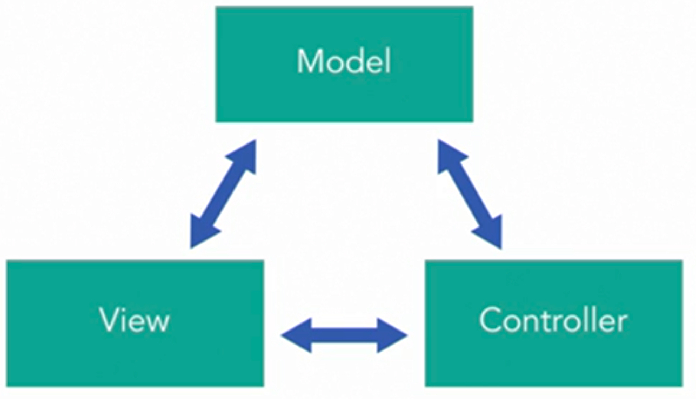
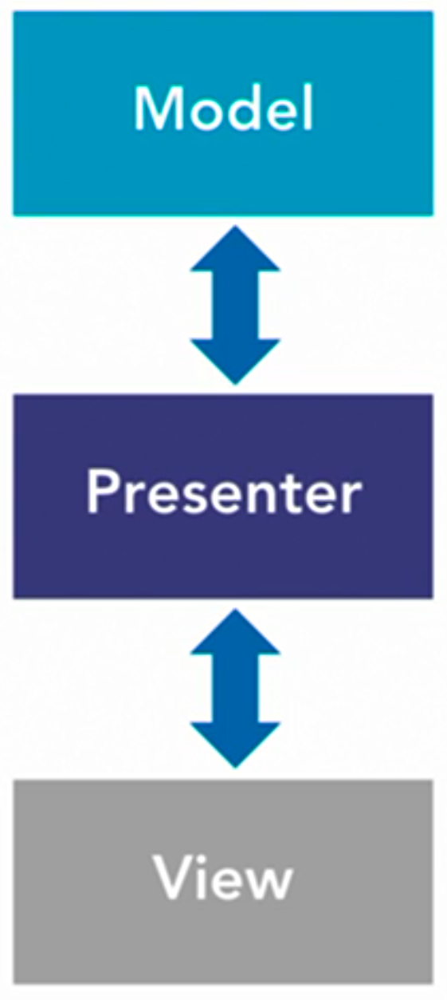
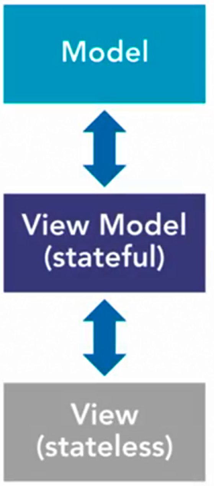
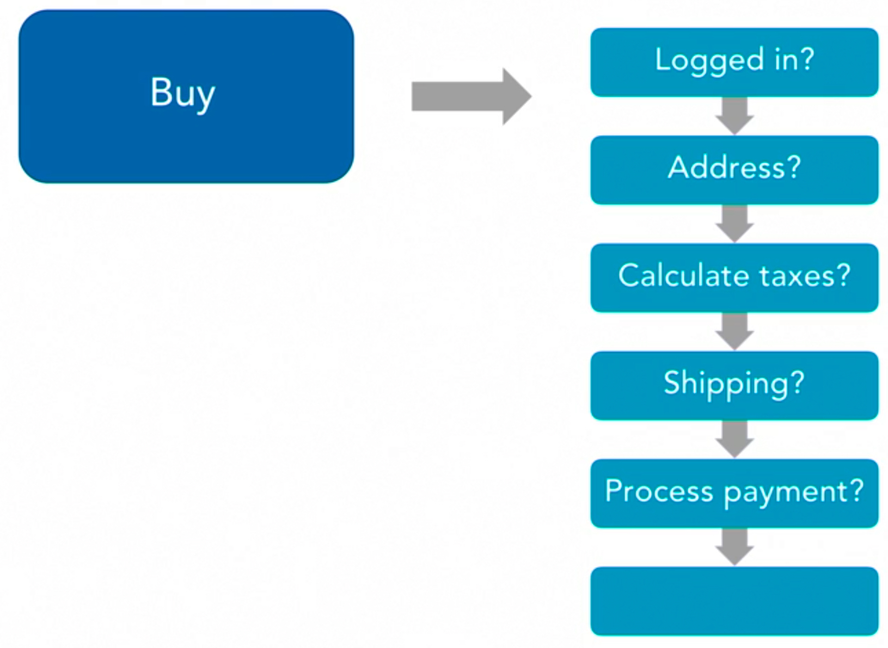
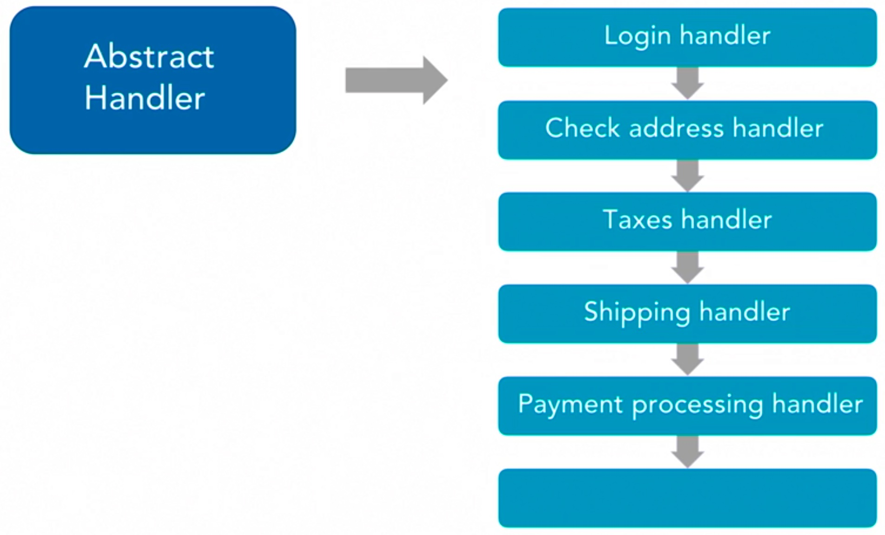

# design-patterns-js-study-notes
Study Notes: JavaScript Design Patterns

**Index:**
  - [1. Introduction](#1-introduction)
  - [2. Creational Patterns](#2-creational-patterns): [Class Design Pattern](#class-design-pattern), [Contributor Pattern](#contributor-pattern), [Singleton Pattern](#singleton-pattern), [Factory Pattern](#factory-pattern), [Abstract Factory Pattern](#abstract-factory-pattern)
  - [3. Structural Patterns](#3-structural-patterns): [Module Pattern](#module-pattern), [Mixins Pattern](#mixins-pattern), [Facade Pattern](#facade-pattern), [Flyweight Pattern](#flyweight-pattern), [Decorator Pattern](#decorator-pattern), [MVC Pattern](#model-view-controller-(mvc)-pattern), [MVP Pattern](#model-view-presenter-(mvp)-pattern), [MVVM Pattern](#model-view-viewmodel-(mvvm)-pattern)
  - [4. Behavioral Patterns](#4-behavioral-patterns): [Observer Pattern](#observer-pattern), [State Pattern](#state-pattern), [Chain of Responsibility](#chain-of-responsibility), [Iterator Pattern](#iterator-pattern), [Strategy Pattern](#strategy-pattern), [Memento Pattern](#memento-pattern), [Mediator Pattern](#mediator-pattern)
---
## 1. Introduction
* What is a pattern?
	* Definition
		* A general, reusable solution to a commonly occurring problem within a given context in software design.
		* Simply a way to resolve problems in code.
	* Types Explored
		* Creational – create new things
		* Structural – structure your code
		* Behavioral – use for behaviors in code
* Functions as first-class citizens
	* [Wikipedia definition](https://en.wikipedia.org/wiki/First-class_function): “A programming language is said to have **first-class functions** if it treats functions as first-class citizens. This means the language supports passing functions as arguments to other functions, returning them as the values from other functions, and assigning them to variables or storing them in data structures.”
* What is a callback and its role?
	* [MDN definition](https://developer.mozilla.org/en-US/docs/Glossary/Callback_function): “A callback function is a function passed into another function as an argument, which is then invoke inside the outer function to complete some kind of routine or action.”
---
## 2. Creational Patterns
* What are creational patterns?
	* Creational patterns… 
		* Control the creation process of an object
		* Applicable to many languages
		* Patterns explored – classes, constructor, singleton, factory, and abstract factory
### Class design pattern
```javascript
class Car {
  constructor(doors, engine, color) {
    this.doors = doors;
    this.engine = engine;
    this.color = color;
  }
}
const civic = new Car(4, 'V6', 'grey');
```
### Contributor pattern
```javascript
// class Car {constructor(){...}}
class SUV extends Car {
  constructor(doors, engine, color) {
    super(doors, engine, color);
    this.wheels = 4; // add default
  }
}
const cx5 = new SUV(4, 'V8', 'red');
```
### Singleton pattern
```javascript
let instance = null;
class SingletonCar {
  constructor(doors, engine, color) {
    if (!instance) {
      this.doors = doors;
      this.engine = engine;
      this.color = color;
      instance = this;
    } else {
      return instance;
    }
  }
}
const civic2 = new SingletonCar(4, 'V6', 'grey');
const honda = new SingletonCar(2, 'V8', 'red'); // this will be created as a copy of civic2
```
### Factory pattern
```javascript
// class Car {constructor(){...}}
class CarFactory {
  createCar(type) {
    switch(type) {
      case 'civic':
        return new Car(4, 'V6', 'grey')
      case 'honda':
        return new Car(2, 'V8', 'red')
    }
  }
}
const factory = new CarFactory();
const myHonda = factory.createCar('honda');
```
### Abstract factory pattern 
```javascript
// class Car {constructor(){...}}
// class CarFactory {createCar(type){...}}
class Jeep {
  constructor(doors, engine, color) {
    this.doors = doors;
    this.engine = engine;
    this.color = color;
  }
}
class JeepFactory {
  createJeep(type) {
    switch(type) {
      case 'cx5':
        return new Jeep(4, 'V6', 'grey')
      case 'sante fe':
        return new Jeep(6, 'V8', 'red')
    }
  }
}
const carFactory = new CarFactory();
const jeepFactory = new JeepFactory();
const autoManufacturer = (type, model) => {
  switch(type) {
    case 'car':
      return carFactory.createCar(model)
    case 'jeep':
      return jeepFactory.createJeep(model)
  }
}
const myCx5 = autoManufacturer('jeep', 'cx5');
```
---
## 3. Structural Patterns
* What are structural patterns?
	* Organization of your code
	* Patterns explored: modules, mixing, facade, flyweight, and decorator
	* Also will look at patterns that apply to applications at large like MVC, MVP, and MVVM
### Module pattern
```javascript
// node/calc.js -> create a module for calculation
const calc = () => {
  return 4 * 3;
}
export default calc;

// node/index.js -> call the calc module in index.js
import calc from './calc';
const aNumber = calc();
app.get('/', (req, res) =>
  res.send(`Showing number ${aNumber} on port ${PORT}`)
);
```
### Mixins pattern
```javascript
let carMixin = {
  revEngine() {
    console.log(`The ${this.engine} engine is doing Vroom Vroom!`);
  }
}
Object.assign(Car.prototype, carMixin); // this passes all car prototypes to carMixin
const anotherHonda = autoManufacturer('car', 'honda');
anotherHonda.revEngine();
```
### Facade pattern
* E.g. in React projects, calling for app.js in index.js - `ReactDOM.render(<App />, document.getElementById(‘root’));`
### Flyweight pattern
* E.g. Singleton Pattern -> to prevent more items being created to minimize memory used
### Decorator pattern
* E.g. Mixins
* [Example code in TypeScript](https://www.typescriptlang.org/docs/handbook/decorators.html#decorator-composition) - not currently available in JS:
```typescript
function f() {
  console.log("f(): evaluated");
  return function (target, propertyKey: string, descriptor: PropertyDescriptor) {
    console.log("f(): called");
  }
}

function g() {
  console.log("g(): evaluated");
  return function (target, propertyKey: string, descriptor: PropertyDescriptor) {
    console.log("g(): called");
  }
}

class C {
  @f()
  @g()
  method() {}
}
```
### Model-View-Controller (MVC) pattern

* Model: Data
* View: Visuals (HTML)
* Controller: Logic
### Model-View-Presenter (MVP) pattern

* Model: Data
* View: Visuals (HTML)
* Presenter: Logic
* Commonly seen in Android development and frameworks such as Backbone.js
### Model-View-ViewModel (MVVM) pattern

* Sometimes referred to as MVVC (Model-View-View Controller)
* Model: Data
* View: Stateless visuals (components)
* View Model: Stateful components
* Used in frameworks such as React and Angular
---
## 4. Behavioral Patterns
* What are behavioral patterns?
	* Focused on the communications between objects
	* Similar to implementing better communications in between us
	* Some examples will be shown and not implemented due to complexity
### Observer pattern
* Meteor API Example: [publish](https://docs.meteor.com/api/pubsub.html#Meteor-publish) | [subscribe](https://docs.meteor.com/api/pubsub.html#Meteor-subscribe)
```javascript
class GasTank {
  constructor(gas) { this.gas = gas; }
  setGasLevel(val) {
    this.gas = val;
    this.notifyAll();
  }
  register(observer) { this.actions.push(observer); }
  unregister(observer) {
    this.actions.remove.filter(function(el) {
      return el !== observer;
    });
  }
  notifyAll() {
    return this.actions.forEach(function(el) {
      el.update(this);
    }.bind(this));
  }
}
```
### State pattern
* React, Angular and any other state management libraries are great examples
### Chain of responsibility
* Instead of , use a handler to handle a chain of activities - 
### Iterator pattern
```javascript
newsfeeds = [
  {
    type: 'top-headlines',
    query: 'sources=bbc-news'
  },
  {
    type: 'everything',
    query: 'domains=techcrunch.com&language=en'
  },
  {
    type: 'technology',
    query: 'domains=comicbookmovie.com&language=en'
  }
]
for (let feed of newsfeeds) {
  console.log(feed.type);
}
```
### Strategy pattern
* Encapsulate code into classes and reuse the code to create new objects
### Memento pattern
* A temporary state of your data retaining the info while being converted from one format to another
* Often used in serialization and deserialization of data
### Mediator pattern
```javascript
class TrafficTower {
  constructor() {
    this.airplanes = [];
  }
  requestPositions() {
    return this.airplanes.map(airplane => {
      return airplane.position;
    });
  }
}
class Airplane {
  constructor(position, trafficTower) {
    this.position = position;
    this.trafficTower = trafficTower;
    this.trafficTower.airplanes.push(this);
  }
  requestPositions() {
    return this.trafficTower.requestPositions();
  }
}
```